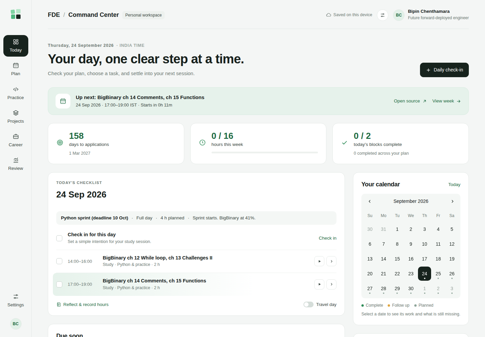
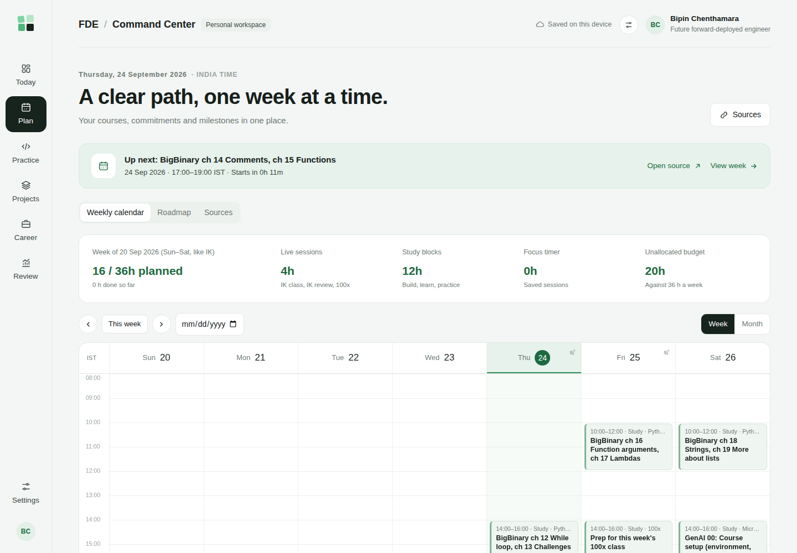
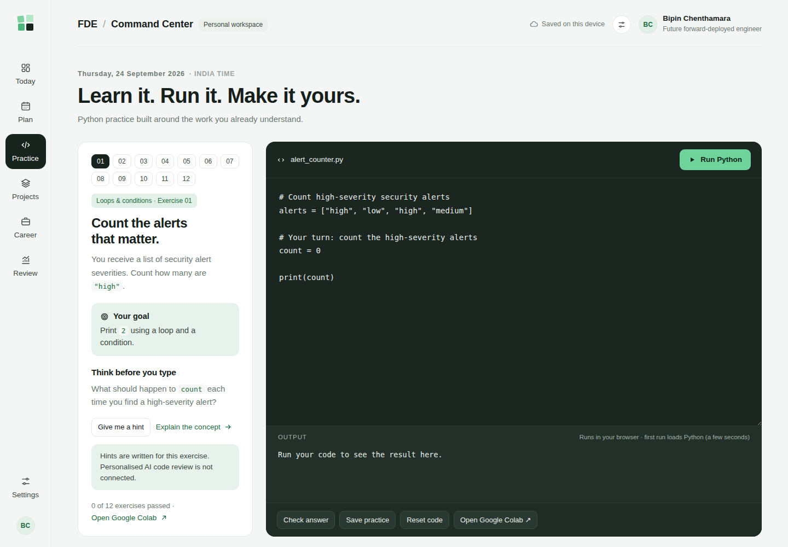
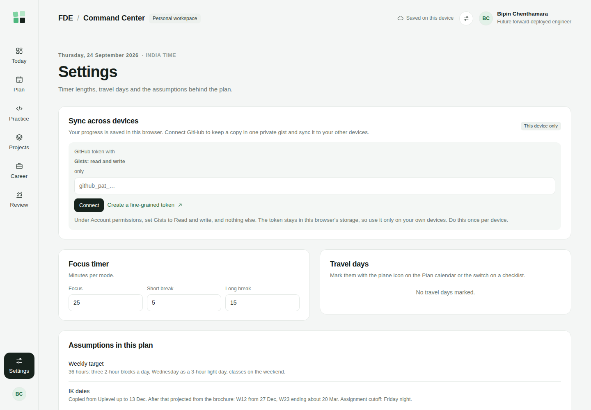

# FDE Command Center

A personal learning dashboard for a six-month move from security architecture into a Forward Deployed Engineer role. It merges four learning streams into one day-by-day plan and tracks whether the work turns into evidence: shipped projects, practice, and interview preparation.

**Live site:** https://vipinchenthamara.github.io/FDE_Command_Center/

| Today | Plan |
|---|---|
|  |  |
| **Practice** | **Settings and sync** |
|  |  |

## What it does

- **Today:** the next block with a countdown, the day's checklist with a check-in and a short reflection, due dates and slipped work, a month calendar with completion dots, and a focus timer tied to the block you are working on.
- **Plan:** a Sunday-to-Saturday week (matching the Interview Kickstart cohort) with a 36-hour budget, live sessions versus study time, notices for days off and recordings, and a travel-day switch that moves the morning build block to the next Wednesday's reserve slot. A Roadmap tab runs to March 2027.
- **Practice:** Python exercises framed around security and Microsoft work (alert triage, Graph API responses, audit decorators, PII redaction). Code runs in the browser through [Brython](https://brython.info/) and each answer is checked.
- **Projects:** the two capstones plus one guided project per week, each moving through five stages from "Not started" to "Portfolio-ready".
- **Career:** preparation steps dated from the plan and a simple opportunities pipeline.
- **Review:** planned versus done hours by week, stream status, a journal of check-ins, and a weekly review.

## The plan behind it

The schedule combines:

- the Interview Kickstart FDE program (live classes, assignment reviews and Friday cutoffs)
- the 100x Engineers applied GenAI cohort
- Microsoft's *Generative AI for Beginners* and *AI Agents for Beginners*, each lesson mapped to the IK week that teaches the same idea
- a Python foundations sprint

Each block links straight to its source lesson. The plan is generated from `tools/build.py` and exported to `plan/plan.json`.

Known assumptions: 100x dates are estimates until 100x publishes a schedule. IK dates after 13 December 2026 are projected one week at a time.

## How it stores data

There is no server. Progress is kept in the browser's local storage. To use it on more than one device, open **Settings → Sync across devices** and paste a GitHub fine-grained token with only the **Gists: read and write** account permission. The page then keeps one private gist (`fde-command-center.json`) and merges changes per document, so edits made on two devices don't overwrite each other.

The token stays in that browser's local storage, so connect only your own devices. Note that "private" gists are unlisted, not access-controlled: anyone with the gist URL can read them.

## Build

```bash
# regenerate the plan (needs openpyxl)
cd tools && python build.py && python export.py && mv plan.json ../plan/plan.json && cd ..
# assemble the single-file site
python tools/assemble.py
```

The site is one static `index.html` (vanilla HTML, CSS and JavaScript), served by GitHub Pages.

## License

MIT
